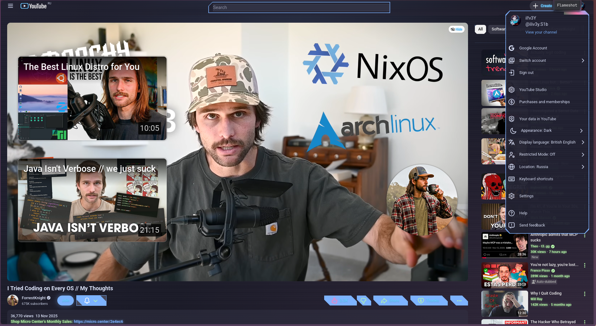

# Catpcypher – YouTube Stylus Theme

YouTube’s default look is a sea of sterile light boxes that scream “2012 corporate intranet.” Catpcypher fixes that by draping the site in an atmospheric gradient, subtle noise, and custom accents that make ZEN (or any Stylus-ready browser) feel like a neon lounge instead of a whiteboard session.

## What’s inside

- `catpcypher-youtube.user.css` – production-ready Stylus stylesheet covering global layout, gradients, scrollbars, and wallpaper overlays for youtube.com.
- `preview.png` – screenshot of the theme running on YouTube in ZEN.

## Theme highlights

- Layered gradient background with animated pulse for subtle motion.
- Tweaked scrollbars, overlays, and containers to remove harsh contrast.
- Wallpaper-ready pseudo-elements so branding art can sit behind the UI.
- Compatible with standard YouTube domains via `@-moz-document` patterns.

## Requirements

- Any modern browser that supports Stylus (ZEN, Firefox, Chrome, Vivaldi, Arc, etc.).
- Stylus extension installed from your browser’s add-on store.

## Install via Stylus

1. Open the Stylus dashboard (`Stylus icon` → **Manage**).
2. Click **Write new style**.
3. Copy the contents of `catpcypher-youtube.user.css` into the editor.
4. Under “Applies to”, choose **URLs on the domain** and enter `youtube.com` (the file already includes a full `@-moz-document`, so Stylus usually auto-detects this).
5. Save and enable the style.

### One-click import (after publishing)

1. Host this repo somewhere accessible (e.g., GitHub).
2. Open the raw view of `catpcypher-youtube.user.css`.
3. Stylus detects the `==UserStyle==` metadata block and shows **Install style**. Click it to sync updates automatically.

## Maintenance tips

- Keep ZEN’s built-in theme minimal; the stylesheet expects a dark baseline to avoid clashing overlays.
- When editing, respect the CSS custom properties at the top—they control palette, wallpaper, and glow intensities.
- Test in both default and theater modes; the layout hooks adjust absolute elements (player overlays, miniplayer) to reduce artifacts.

## License

This theme is licensed under the MIT License. See `LICENSE` for details.
