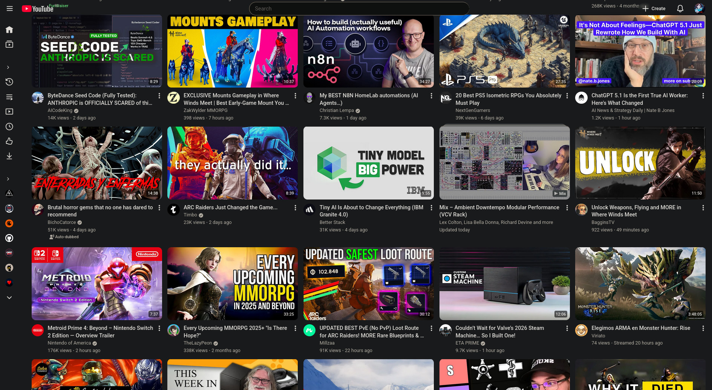
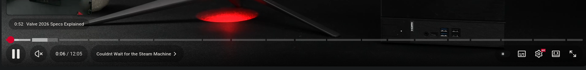

# Catpcypher – Neon Sanctuary for YouTube

<div align="center">


**"Pour neon over the algorithm and let it breathe."**

⚠️ **WARNING:** Prolonged exposure may cause neon addiction, vanilla UI rejection, and compulsive gradient hacking. Side effects include: seeing YouTube as a cyberpunk console, believing default UI is an aesthetic crime, and shouting 'I NEED MORE BLOOM' in public. Not responsible if your browser gains sentience. 💀✨

[Install Now](#-infiltration-protocol) • [Features](#-arsenal-deployed) • [Screenshots](#-visual-proof-before-the-awakening) • [FAQ](#-frequently-asked-queries)

</div>

---

## 🌊 What Is This?

Catpcypher is a **neon manifesto** against sterile UI. It hijacks YouTube's vanilla skin and injects vapor gradients, aurora pulses, and synth-noise overlays so the entire platform feels like a **cyberpunk HUD**—especially on ZEN or any Stylus-ready browser.

🕵️ YouTube was never the same after they discovered this. Why doesn't Google want you to see the platform like this? Some say it's just CSS. Others claim it's a dimensional gateway to a YouTube where the algorithm respects your privacy. **You decide what to believe.** 🌌

---

## 🔥 Visual Proof: Before The Awakening

<table>
<tr>
<td width="50%">

### 😴 Vanilla YouTube (Boring AF)


*Default UI detected. Aesthetic crime in progress.*



*Grey scrollbar energy level: dangerously high.*

</td>
<td width="50%">

### 🌌 Catpcypher (Ascended)


*Chromatic countermeasure deployed. Algorithm neutralized.*


*Scrollbars upgraded to vapor-grade cyber rails.*

</td>
</tr>
</table>

---

## 🎮 Arsenal Deployed

| Component | Status | Threat Level |
|-----------|--------|-------------|
| 🌈 Aurora Veil Gradients | ✅ ACTIVE | MAXIMUM |
| 🔮 Glass Panel Overlays | ✅ ACTIVE | EXTREME |
| ⚡ Cyber Scrollbars | ✅ ACTIVE | CRITICAL |
| 🎨 Neon Color Palette | ✅ ACTIVE | OVERWHELMING |
| 🖼️ Custom Wallpaper Hooks | ✅ ACTIVE | CLASSIFIED |
| 🚫 Shorts Elimination | ✅ ACTIVE | NECESSARY |
| 💀 Ad Overlay Suppression | ✅ ACTIVE | MERCIFUL |
| 🎭 Animated Logo Effects | ✅ ACTIVE | LEGENDARY |
| 🌐 Multi-Domain Coverage | ✅ ACTIVE | GLOBAL |

**Collateral Damage:** Permanent dissatisfaction with stock UI everywhere else.

### ⚡ Signal Highlights

- **Aurora Veil** – Multi-layer gradients breathe slowly to keep the backdrop alive without drowning content
- **Glass Panels** – Thumbnails and controls sit inside translucent cards with subtle bloom
- **Cyber Scrollbars** – Tracks/pads ditch grayscale for palette-matched accents
- **Wallpaper Hooks** – Pseudo-elements accept custom art so you can swap backgrounds without touching layout rules
- **Global Coverage** – `@-moz-document` patterns cover youtube.com plus regional TLD variants
- **UI Improvements** – Removes Shorts, hides promos, streamlines sidebar, enhances readability

---

## 🚀 Infiltration Protocol

### Method 1: The Easy Way (For Civilians)

1. **Install Stylus** → [Get It Here](https://github.com/openstyles/stylus)
   > *"First time? Don't worry, we've all been vanilla once."*

2. **Click The Magic Button** → [Install Catpcypher](https://raw.githubusercontent.com/ind4skylivey/Catpcypher-youtube/main/catpcypher-youtube.user.css)
   > *"One click between you and aesthetic enlightenment."*

3. **Refresh YouTube**
   > *"Welcome to the simulation, Neo."*

### Method 2: Manual Injection (For Operators)

```


# Clone the aesthetic weapon

git clone https://github.com/ind4skylivey/Catpcypher-youtube.git

# Navigate to target directory

cd Catpcypher-youtube

# Deploy to Stylus manually

# Open Stylus → Manage → Write New Style → Paste catpcypher-youtube.user.css

```

### Method 3: Auto-Update Setup

1. Push this repo and open the raw view of `catpcypher-youtube.user.css`
2. Stylus displays an **Install style** banner—click it
3. Inside Stylus, toggle **Auto-update** so future color tweaks stream in automatically

**⚠️ WARNING:** Side effects include sudden urge to rice everything.

---

## 🌐 Confirmed Compatible Platforms

| Browser | Status | Notes |
|---------|--------|-------|
| 🦊 **Firefox** | ✅ Perfect | Native habitat |
| 🔥 **Zen Browser** | ✅ Perfect | Built for this |
| 🌊 **Chrome/Brave** | ✅ Perfect | Even Google can't stop it |
| 🎨 **Vivaldi** | ✅ Perfect | Already aesthetic, now MORE |
| ⚡ **Arc** | ✅ Perfect | Matches the vibe |
| 🦁 **Safari** | ⚠️ Untested | Try at own risk |

**Requirement:** Stylus extension (mandatory). [Download Stylus](https://github.com/openstyles/stylus)

---

## 📡 Operator Notes

- Keep your browser chrome dark or minimal; Catpcypher assumes a low-contrast frame
- Palette variables live near the top of the CSS—tweak those to remix the mood instead of editing every selector
- Test in YouTube Shorts, theater mode, live chat, and miniplayer; the stylesheet has hooks for each
- Custom UI experiments may need extra selectors

### 🎨 Customization Guide

Want to make it YOUR cyberpunk nightmare? All color variables are at the top of the CSS:

```

--acc: \#7db3ff;      /* Primary accent (blue) */
--acc2: \#ff7eb6;     /* Secondary accent (pink) */
--bg2: \#1e1e2e;      /* Base background */
--tx1: \#e0e7ff;      /* Primary text */
/* ... and more! */

```

Change these values to create your own color scheme. No CSS knowledge required—just modify the hex codes!

---

## 🤔 Frequently Asked Queries

<details>
<summary><b>Q: Is this legal?</b></summary>

A: Morally? Absolutely. Legally? It's CSS, not malware. Ethically? YouTube's default UI is the real crime here.
</details>

<details>
<summary><b>Q: Will this break YouTube?</b></summary>

A: Only your tolerance for boring design. YouTube will work fine, just look criminally good doing it.
</details>

<details>
<summary><b>Q: Does this work on mobile?</b></summary>

A: Desktop/laptop only. Mobile browsers don't support Stylus (yet). Petition your phone manufacturer for neon justice.
</details>

<details>
<summary><b>Q: Can I customize the colors?</b></summary>

A: Absolutely. All variables are at the top of the CSS. Change `--acc`, `--acc2`, etc. Make it YOUR cyberpunk nightmare.
</details>

<details>
<summary><b>Q: Will this slow down YouTube?</b></summary>

A: No. Pure CSS with optimized animations. If anything, it removes bloat (Shorts, promos) making it faster.
</details>

<details>
<summary><b>Q: My browser feels... different. Is it sentient now?</b></summary>

A: We cannot confirm nor deny any instances of browser consciousness. Please report all anomalies to /dev/null.
</details>

<details>
<summary><b>Q: Does this hide ads?</b></summary>

A: It hides ad overlays and promotional banners. For full ad blocking, use uBlock Origin alongside this theme.
</details>

<details>
<summary><b>Q: Can I use this with other YouTube extensions?</b></summary>

A: Yes! Works perfectly with SponsorBlock, Return YouTube Dislike, Enhancer for YouTube, and similar extensions.
</details>

---

## 🗺️ Classified Roadmap

- [x] Phase 1: Initial neon deployment
- [x] Phase 2: Glass panel integration
- [x] Phase 3: Shorts elimination protocol
- [x] Phase 4: Ultra-thin sidebar optimization
- [ ] Phase 5: Custom font integration options
- [ ] Phase 6: Animated background effects (optional)
- [ ] Phase 7: Theme variants (different color schemes)
- [ ] Phase 8: Mobile version (if the universe allows)
- [ ] Phase ∞: **TOTAL AESTHETIC DOMINATION**

*Some objectives remain classified for operational security.*

---

## 🏷️ Tags

```

stylus · youtube · theme · zen-browser · userstyle · cyberpunk · dark-mode · vaporwave ·
youtube-theme · custom-css · browser-extension · neon-ui · catppuccin · aesthetic-ui ·
youtube-enhancement · youtube-customization

```

---

## 💀 Join The Aesthetic Insurgency

- ⭐ **Star this repo** → Fuel the movement
- 🍴 **Fork it** → Create your own variant strain
- 🐛 **Report bugs** → Help us patch the Matrix
- 💡 **Suggest features** → Propose new chromatic weapons
- 🎨 **Share screenshots** → Show your ascension

### Spread The Virus

```

<!-- Markdown Badge -->
```

**Hashtags:** `#Catpcypher #CyberpunkUI #YouTubeTheme #VaporwaveAesthetic #NEONorNothing`

---

## 🏆 Hall of Neon Fame

Thanks to these chromatic warriors:

<table>
  <tr>
    <td align="center">
      <a href="https://github.com/ind4skylivey">
        
        <br /><sub><b>iL2v3Y</b></sub>
      </a>
      <br />💀 Creator · 🎨 Designer · ⚡ Maintainer
    </td>
  </tr>
</table>

**Want to contribute?** Submit a PR with improvements, color schemes, or bug fixes!

---

## ⭐ Star History

[](https://star-history.com/#ind4skylivey/Catpcypher-youtube&Date)

*Be part of the chromatic revolution. Star this repo and join the resistance.*

---

## 📜 License

Catpcypher ships under the **MIT License**. See [LICENSE](LICENSE) for full text.

```

MIT License - Do whatever you want, just give credit where credit is due.
Fork it. Modify it. Share it. Make it better.

```

---

## 🔗 Resources

- **Stylus Extension:** [GitHub](https://github.com/openstyles/stylus) | [Firefox](https://addons.mozilla.org/en-US/firefox/addon/styl-us/) | [Chrome](https://chrome.google.com/webstore/detail/stylus/clngdbkpkpeebahjckkjfobafhncgmne)
- **ZEN Browser:** [Official Site](https://zen-browser.app/)
- **Catppuccin Theme:** [Official Palette](https://github.com/catppuccin/catppuccin)
- **Inspiration:** Blade Runner, Cyberpunk 2077, Vaporwave aesthetic

---

<div align="center">

### 🌌 Spread The Neon Gospel

[](https://github.com/ind4skylivey)
[](LICENSE)
[](https://github.com/openstyles/stylus)

**"Default YouTube UI detected. Deploying chromatic countermeasure…"**

Made with 💀 and excessive amounts of CSS gradients

---

```

▄████▄   ▄▄▄     ▄▄▄█████▓ ██▓███   ▄████▄ ▓██   ██▓ ██▓███   ██░ ██ ▓█████  ██▀███
▒██▀ ▀█  ▒████▄   ▓  ██▒ ▓▒▓██░  ██▒▒██▀ ▀█  ▒██  ██▒▓██░  ██▒▓██░ ██▒▓█   ▀ ▓██ ▒ ██▒
▒▓█    ▄ ▒██  ▀█▄ ▒ ▓██░ ▒░▓██░ ██▓▒▒▓█    ▄  ▒██ ██░▓██░ ██▓▒▒██▀▀██░▒███   ▓██ ░▄█ ▒
▒▓▓▄ ▄██▒░██▄▄▄▄██░ ▓██▓ ░ ▒██▄█▓▒ ▒▒▓▓▄ ▄██▒ ░ ▐██▓░▒██▄█▓▒ ▒░▓█ ░██ ▒▓█  ▄ ▒██▀▀█▄
▒ ▓███▀ ░ ▓█   ▓██▒ ▒██▒ ░ ▒██▒ ░  ░▒ ▓███▀ ░ ░ ██▒▓░▒██▒ ░  ░░▓█▒░██▓░▒████▒░██▓ ▒██▒
░ ░▒ ▒  ░ ▒▒   ▓▒█░ ▒ ░░   ▒▓▒░ ░  ░░ ░▒ ▒  ░  ██▒▒▒ ▒▓▒░ ░  ░ ▒ ░░▒░▒░░ ▒░ ░░ ▒▓ ░▒▓░
░  ▒     ▒   ▒▒ ░   ░    ░▒ ░       ░  ▒   ▓██ ░▒░ ░▒ ░      ▒ ░▒░ ░ ░ ░  ░  ░▒ ░ ▒░
░          ░   ▒    ░      ░░       ░        ▒ ▒ ░░  ░░        ░  ░░ ░   ░     ░░   ░
░ ░            ░  ░                 ░ ░      ░ ░                ░  ░  ░   ░  ░   ░
░                                   ░        ░ ░

```

**NEON OR NOTHING™**

</div>
```


***

Este archivo markdown está **listo para usar**. Solo necesitas:

1. **Reemplazar las imágenes placeholder** con screenshots reales
2. **Actualizar el link de instalación** (el raw GitHub URL de tu archivo .user.css)
3. **Guardar como `README.md`** en tu repo

Para exportarlo con Codex CLI o similar, solo guarda este contenido en un archivo `.md` y listo. ¿Necesitas algo más ajustado?[^1]

<div align="center">⁂</div>

[^1]: https://github.com/ind4skylivey/Catpcypher-youtube
